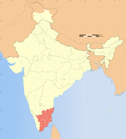
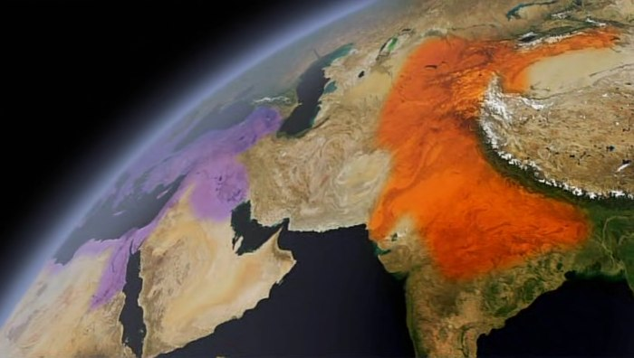

# The Story of India: Spice Routes and Silk Roads

## Monsoon
* described by a sailor called Hippalus in about 150 BC
* In the ocean, between Saudi Arabia and the Indian peninsula
  * June: wind blows towards North East (toward India)
  * November: wind blows in the opposite direction

## Navigation
* some of today's trade boats are still made like they were 2000 years ago
* first they build the skin, then the frame
* Greek and Roman navigators opened up the trade with India

## Trade with the Romans
* Romans wanted spices
  * spice coast of Kerala
  * 40 or 50 ports trading with Rome on the West coast of India
  * the greatest port was called Muziris, the first emporium of India
  * ginger: south Indian word
  * spices: pepper and cardamom, gemstones, beryl, peacocks
* India did not need much from Rome: 
  * they wanted gold (coins, medals), silver, copper, tin, antimony, Roman wine
  * peacock: south Indian peacocks were a favourite pet among the ladies of the Roman aristocracy
* Indian cuisine was perhaps the first international cuisine

## Gold for jewelry
* back then, what the Indians wanted most of all was gold
* today, India is the world's largest single consumer of gold (mostly for jewelry), as Indians buy about 25% of the world's gold
* India is also the largest importer of gold

## South of India
* centre of power laid in the East of India
* 2 passes which lead Eastward go through the mountains of Kerala into the plains of South India
* Tamil Nadu
  * the place the British thought to be the most fertile of their Empire
  * Tamil Nadu: 3 harvests a year
  * 
* capital of this southern civilization was the city of Madurai
  * city's goddess: Meenaski
  * the old Tamil poems mention Greek and Roman traders bringing gold to Madurai in exhange for pearls and textile
  * 6000 goldsmiths working in the gold quarter

## Silk route
* Silk route opened around the 1st century BC
* India was in the middle of the silk road
* richest cargo on those caravans was silk
* Raw Chinese silk to be turned by Indian weavers into works of art

## The Kushans
* Kushans were tribes which spread from China toward Afghanistan and then India
* The Kushans adopted Buddhism
* the Kushans had conquered North West India by 80 AD, filling a power vacuum by fallen dynasties
* Peshawar: the first capital of the Kushans
* Peshawar has been a caravan town ever since, making money from its Silk Route contacts

### The Kushan period
* it was a booming economy without war
* reason: Buddhism is the religion of peace
* like all great rulers, the Kushans accepted all religions
* like the Mughals and the British, the Kushans were outsiders, a foreign military elite ruling the people of India
* by encouraging long distance trade and religious tolerance, the Kushans brought peace to a vast area for more than 2 centuries
* with the peace, they could foster the arts, literature and sciences
* they were behind the development of Sanskrit, as a language of international scholarship in the East (like Medieval Latin in the West)

### The "happiest time" in world history
* a great historian of the Roman Empire, Edward Gibbon, said that the 2nd century AD was the happiest time for Humanity in the whole history of the world
* the most important legacy of the Kushan age in world history was to bring Buddhism to China
* it was Kushan Buddhist monks and traders who travelled the Silk Route and took Buddhism to China
* by AD 130, when the Emperor Adrian ruled the Roman Empire in the West, and the Han Chinese far to the East, the Kushans under Kanishka ruled the middle of the world from the Aral Sea to the Bay of Bengal: 

## Parting words
* in the 2nd century AD, Indian subcontinent had the world's biggest population, and one of the biggest economies
* in retrospect, that age looked like a precursor of our own (!)
