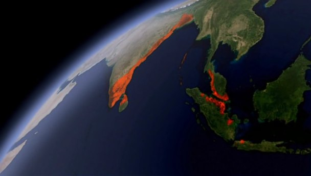

# The Story of India: Ages of Gold

During the dark ages of Europe (400 AD), India has a Golden Age

## tale of Rama
* the god who came down to Earth as a king who defeated evil and ruled with justice
* 300 versions of the Rama story in 20 different languages
* the "Bible of India"
* 31 days of performance of the plays of the story of Rama
* Mahatma Ghandi himself invoked the return of the rule of Rama

### The story of Rama
* it begins with the abduction of a beautiful queen
* wicked demon king seizes Sita, the faithful wife of Rama, the exiled king of Ayodhya
* the demon takes Sita back to his island fortress
* the distraught king sets out to find her, helped by the monkey Hanuman
* Rama crosses the sea and rescues Sita after a heroic battle
* Rama returns to reign in the city of Ayodhya and brings in the Golden Age

## The Guptas
* the myth became history
* the Guptas took a conscious decision to locate the golden city of Rama in a real place
* from where they would rule and create their own golden time
* the city of Saketa was given a new name and identity: Ayodhya
* on the banks of the Gogra river
* Rama was an incarnation of god on Earth
* fiercely contested by Hindu fundamentalists who sought the supremacy of Hinduism

## Gupta period
* Fahsien traveled to the Ganges plains
* pluralist country
* Buddhism thrive along with hindu religion
* they mastered metal casting
* high iron pillar which stands in Delhi today

## Leaps in all fields
* after defeating the Huns, the Gupta kings made their court the centre of high culture, drama and literature, science
* use of zero in math
* Aryabhatta, an astronomer 500 AD, proved the Earth went round the sun

## Kama Sutra
* world’s first sex guide
* Kama: sense of consciousness of having all senses organs elevated when you are in the act of making love
* Kama Sutra was written in the 5th century

## Hindu philosophy
* dharma: righteous human being (virtue)
* artha: fathering wealth
* kama: idea of love
* moksha: liberation
* men and women are equal
* the product of an age of freedom of thought

## The Cholans
* in the Southern India and islands
* heyday: from 900 to 1300 AD
* their capital was Tanjore, in Tamil Nadu
* at the heart of Tanjore lies a temple of the creator of the empire
* Rajaraja, the King of Kings
* a civilization that still exists today
* the temple is a record keeper
* temple is a written-record of the administration of the Cholan empire
* the Cholan age was one of the greatest periods of Indian art
* the Cholans: one of the world's great power
* colonies in Java, Sumatra and the islands of Indonesia:

* pace in South India is slower

## Tamil
* Tamil is the last living classical Indian language
* Tamil is one of 23 official Indian languages, with a literature comparable to any in the West

## Parting words
* in a world where ancient traditions have been wiped out in a few generations, in India, they've kept touch with their deep past
