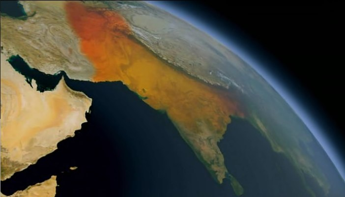

# The Story of India: The Meeting of Two Oceans

## Sultan Mahmoud of Ghazni
* the head of the Muslim Empire in Afghanistan
* Mahmoud was a Sufi
* traveled to the city of Multan, located in the North of India
* it was his base from which he raided in the rest of India
* led a dozen expeditions into India
* the most famous was in 1025 (20 000 camels), in order to attack Somnath

## The Clash between Island and Hindu
* historian Al Biruni (who was no fan of Mahmoud) said:
* 12 great plundering expeditions engendered a hatred among Hindus for the Turks (the Muslims)
* but what appears to be a clash of civilizations will become over time one of the most remarkable cultural crossovers in the history of civilization
* it will later be called by a great Indian prince "the meeting of two oceans"
* today Indian has half of the world's Muslims

## Military conquests
* 1192 came a new phase : military conquest
* Afghans and Turks became Sultans of Delhi
* they built a giant minaret, Qutab Minar, "the might of Islam", a statement of conquest
* the dynasties of Sultans of Delhi ruled for 300 years
* Islam could not possibly convert India
* they had to co-exist

## Khyber pass
* border between Pakistan and Afghanistan
* route taken by many great invaders in history (Alexander the Great, Genghis Khan, Timburlaine)

## The Moghul invasion
* 1525, the Moghul new invaders came down
* 5 assaults to India
* the last one, 1526 
* Moghul army
  * 12 000 men
  * leader: Babur (descendant from of Ghengis Khan and Tamerlaine)
  * artillery of canons
* Indian army
  * leader: Ibrahim, Sultan of Delhi
  * 100 000 men
  * 1000 war elephants
* it was Muslim ruler against Muslim invader, Moghul against Hindus

## The Moghul rule
* Babur built the 1st Moghul mosque in India
* new style of architecture
* Babur's grand son is Akbar, one of India's greatest rules
* Akbar became king in 1556 (he was 13 year old)
* the Sikhs were one of the radical religious groups who'd sprung up out of the interaction of Hinduism and Islam in the 16th century
* the Sikhs' 5 K's: Kesh (unshorn hair), Kanga (wooden comb), Kara (bracelet), Kaccha (baggy short), Kirpan (knife)
* Akbar's thoughts: everything religion is wrong, but all differences had to be tolerated
* Akbar embraced all India's religions
* The Moghul ruled over the North of India for more than 300 years, displaced by the British
* Moghuls' empire area at the end of the 1500's: 
* Elizabeth I wrote to Akbar: the singular report of your Majesty's *humanity* has reached even those distant shores of the world
* 2 important aspects of Akbar: humanity and rationality
* "Elizabeth I" = "Elizabeth of England" = "Elizabeth Tudor"
* Akbar dies in 1605, 2 years after Elizabeth I's death
* India had then the largest GDP in the world
* but the empire declined after Akbar's death

## The Taj Mahal
* in the 17th century, the Moghuls pursued their dream of regaining their ancestral homeland in Central Asia
* at home they engaged in vast building projects, e.g. Taj Mahal
* large walled garden on the other side of the Jamuna river
* product of the Hindu-Muslim synthesis of the 17th century
* shocking poverty in most of the rural workforce
* more than 20% of the national income was spent on the court elite

## India as the most diversified country in the world
* religions
* cultures
* languages
