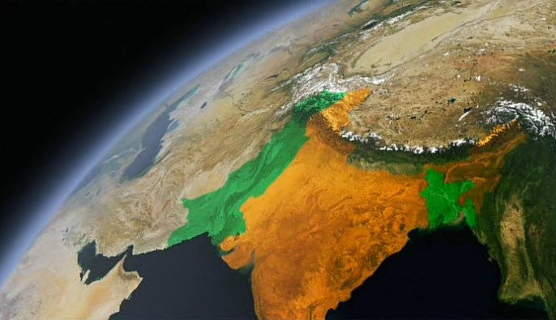

# The Story of India: Freedom and Liberation

## Context
* India divided into many princely states
* Moguls were still in the North
* the British and the French are fighting fighting in South India
* Tamils are caught in the fire
* key to the British empire was the fort of Madras

## 1799: British victory
* a victory after the great battles in South India at Seringapatam
* a crucial turning point for East India company (profits will soon increase)
* British controlled Bengal: opium, textiles
* Bengal became a mainstay of British imperialism
* the British started to recovery of the ancient Indian past
* Major General Charles Stuart, nickname "Hindu Stuart", worshipped Hindu gods
* mixed Hindu-Muslim culture in the Ganges Plains

## Cohabitation between the Hindu and the Muslim
* In the Middle Ages, relations between Hindus and Muslims had often been marred by the intolerant attitudes of some Muslim rulers.
* But accommodation under the later Moghuls gave birth to the most seductive and charismatic of all Indian civilizations in Lucknow under the Muslim nawabs.
* Indian renaissance in the 18th: a mixture of Hindu and Muslim culture

## Great rebellion of 1857
* British more intolerant under the growing influence of evangelical Christian missionaries
* decree replacing Persian with English as the language of administration and education 
* the feeling is that the British are the people who destroy all religions
* they destroyed Delhi
* in 1857, the 2 principle forces that have guided the Indian history for the last 300 years come to an abrupt end:
  * the Moghuls end
  * East India Company ends
* British government impose direct rule from London 

## British Raj
* The British Raj (rāj, lit. "reign" in Sanskrit) was British rule in the Indian subcontinent between 1858 and 1947
* the British Raj was most of the most ingenuous empires in history
* immense patchwork: 
  * 675 princely states
  * 25% of the people of the planet
* 1881: 1st census, first item was religion
* > 2 millions Indians fought on behalf of the British under WW1

## Indian National Congress
* centre-left
* 1885: first congress in Mumbai
* one of the two major political parties in India
* became a pivotal participant in the Indian Independence Movement, with over 15 million members and over 70 million participants in its struggle against British colonial rule in India.
* Mahatma Gandhi: President of Congress party during 1924

## Amritsar massacre
* a city in the north-western part of India
* the shooting that took place was ordered by Brigadier-General Reginald E.H. Dyer.
* 1919, Dyer was convinced of a major insurrection and thus he banned all meetings. 
* On hearing that a meeting of 15,000 to 20,000 people including women, senior citizens and children had assembled at Jallianwala Bagh, Dyer went with fifty riflemen to a raised bank and ordered them to shoot at the crowd.
* 400 people killed at Amritsar
* Historians considered the episode as a decisive step towards the end of British rule in India
* the Amritsar massacre gave an irresistible impetus to the freedom movement

## India's Independence Movement
* ancient Indian idea of non-violence
* main players (British lawyers) for the planners of the independence:
  * Mahatma Ghandi - preeminent leader of the movement
  * Jawaharlal Nehru (star of the Congress),  first Prime Minister of India
  * Jinnah (Muslim league) - founder of Pakistan
* Jinnah pushed for a separate state for Muslim: Pakistan

## Partition of India in 1947
* done on the basis of religious demographics
* the violent nature of the partition created an atmosphere of mutual hostility and suspicion between India and Pakistan that plagues their relationship to this day
* Muslims into the new Pakistan
* Hindus and Sikhs, eastward into India
* migration of 14 million people (!)
* creation of the Dominion of Pakistan in 1947: 
* 1971: East Pakistan (with the help of India) became the People's Republic of Bangladesh