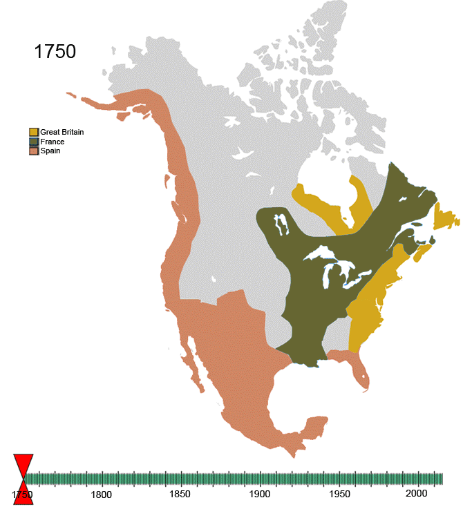

# Louisiana

1. Louisiana is inhabited by Native Americans
2. Louisiana belongs to Spain
3. 1800: Napoleon exchanges the Louisiana territory against some other territory in Tuscany
4. 1803: "Louisiana purchase" (Napoleon sells it to USA)

## Animated map
