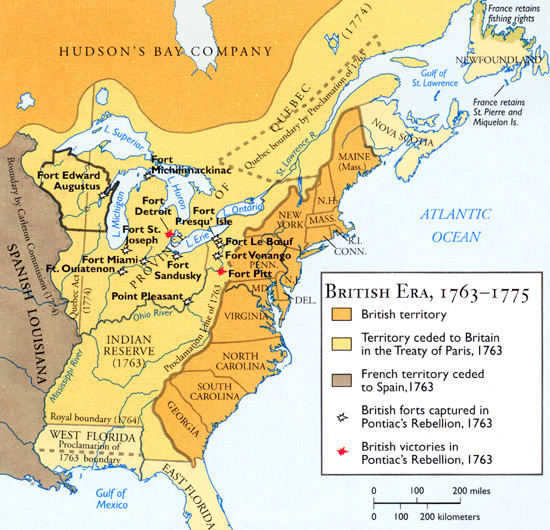
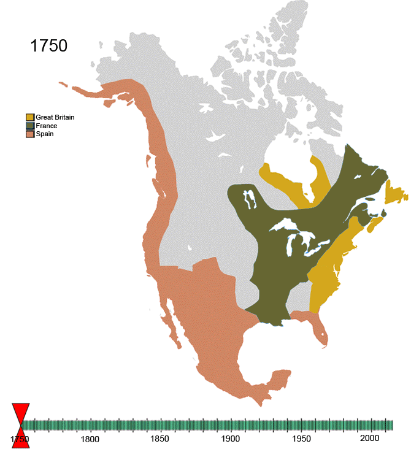

# The land which changes hands in North America

## Royal Proclamation of 1763
The Royal Proclamation of 1763 was issued October 7, 1763, by King George III following Great Britain's acquisition of French territory in North America after the end of the French and Indian War/Seven Years' War, in which it forbade settlers from settling past a line drawn along the Appalachian Mountains. 

* source: http://cdn.dipity.com/uploads/events/75fc9ce96291845aaf216e89aff4a9ae_1M.png

## Louisiana timeline

1. Louisiana is inhabited by Native Americans
2. Louisiana belongs to France
3. 1763: Louisiana ceded to Spain
4. 1800: Napoleon exchanges Louisiana against some land in Tuscany
5. 1803: "Louisiana purchase" (Napoleon sells it to USA)

## Animated map (1750 - 2008)

* source: http://en.wikipedia.org/wiki/File:Non-Native-American-Nations-Territorial-Claims-over-NAFTA-countries-1750-2008.gif
