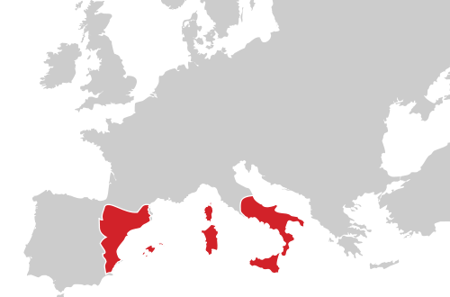

# European history around 1492

## Facts around the Borgias
* the Borgia family is an Italian dynasty of Aragonese origin
* after the death of Pope Innocent VIII, Cardinal Rodrigo Borgia, with the help of his sons, bribes and cajoles other cardinals to vote for him in the conclave to elect the new pontiff
* Rodrigo Borgias, the powerful Renaissance Valencian, was named Pope Alexander VI from 1492 to 1503
* Pope Julius II:
  * nicknamed "The Fearsome Pope" (Il Papa Terribile) and "The Warrior Pope" (Il Papa Guerriero)
  * born Giuliano della Rovere, 
  * was Pope from 1503 to 1513 (succeeding to Rodrigo Borgia, the pope Alexander VI)
* Lucrezia Borgia was the illegitimate daughter of Rodrigo Borgia
* Lucrezia was married to Giovanni Sforza (Lord of Pesaro), Alfonso of Aragon (Duke of Bisceglie), and Alfonso I d'Este (Duke of Ferrara)
* Columbus brought 7 (not 1 like in the series) Taino Indians to Spain, where they were baptized, with the King Ferdinand of Aragon and Prince Juan acting as godfathers; they returned as interpreters with Columbus on his second voyage in 1493
* Cantarella was most probably a variation of arsenic or cantharidin powder (made from blister beetles) and alleged by Borgia enemies to have been used by Pope Alexander VI, Rodrigo Borgia. Many writers dismiss these allegations as slander.
* Italy at the time:
  * north west lies the Duchy of Milan (led by Ludovico Sforza)
  * north east: Republic of Venice
  * middle-north: Republic of Florence (ruled by the Medici family)
  * middle: Romania (ruled by the great Roman families)
  * Rome and the papal states
  * south: kingdom of Naples (nearly half of the boot). Both France and Spain have traditional claims on Naples

## Niccolò Machiavelli 
* he was for many years an official in the Florentine Republic, with responsibilities in diplomatic and military affairs
* he was Secretary to the Second Chancery of the Republic of Florence from 1498 to 1512, when the Medici were out of power

## Catholics and Protestants
* the most significant religious conflict was between the established Roman Catholic church and the Protestant movements that arose in the Early Modern Period. 
* for example in England:
  * during Tudor rule when Henry VIII established the Church of England, it was Protestant
  * when he died the reign passed to his sickly son, Edward VI who ruled for a short time, 
  * when Edward died, his eldest daughter Mary brought back Catholicism, and was known as "Bloody Mary" for killing protestants
  * when she died, Elizabeth I "Virgin Queen" (queen regnant of England and Ireland from 17 November 1558 until 1603) once again brought back Protestantism
* the Church of England is also known as the Anglican Church) which to this day remains the established Church
* protestant reformation era left major legacies:
  * created almost all major Christian traditions that would eventually take root in American soil: Protestantism, Catholicism, and radical Protestant sects. 
  * high value on reading and education 
  * protestantism denied that God had given priest special powers

## Portugal takes the lead at sea
* prince Henry (1394–1460) of Portugal is called “Henry the Navigator”
  * he founded sailing school 
  * he sponsored 1st European sea voyages, e.g. sends Portuguese ships to explore west coast of Africa
  * his motivation was the need to know (typical of the epoch)
* Portuguese explorations continued after Prince Henry died
* Bartolomeu Dias rounded the southern tip of Africa in 1488
* Vasco da Gama reached India ten years later
* By sailing around Africa to eastern Asia via the Indian Ocean, Portuguese traders were able to cut their costs and increase their profits
* however, it was Isabella (of Spain) who sponsored Christopher Columbus

## Spain 
* By the early 700s, Muslim armies had seized huge areas of Asia and North Africa, along with most of the Iberian Peninsula, where Spain and Portugal sit
* To regain this territory, Spanish Christians waged a campaign called the reconquista, or reconquest
* By 1492, the forces of the combined kingdoms of Queen Isabella of Castile and King Ferdinand of Aragon, who married in 1469, finally drove the Muslims from the peninsula
* This victory ended more than 7 centuries of religious warfare. A united Spain stood ready to assert itself internationally and to spread Christianity around the globe
* Here is what Europe looked like in 1492: 
* Here is the evolution of European Colonial Empires from 1492 to today: 

## The Crusades
* Christian armies from all over western Europe responded to the church’s call to force the Muslims out of the Holy Land around Jerusalem
* from 1096 to 1270, Europeans launched the Crusades, a series of military expeditions to the Middle East in the name of Christianity
* in the end, these bloody Crusades failed to “rescue” the Holy Land, but they had two consequences that encouraged European exploration and expansion
  * they sparked an increase in trade, as crusaders returned home with a new taste for products from Asia
  * the Crusades weakened the power of European nobles, many of whom lost their lives or fortunes in the wars. Monarchs were able to take advantage of the nobles’ weakened ranks by consolidating their own power. Eventually, monarchs sponsored overseas exploration in order to increase their wealth and power

## Decline of the Church's authority
* the Crusades had a third long-term consequence: the decline of the power of the pope
* the ultimate failure of these campaigns weakened the prestige of the papacy (the office of the pope), which had led the quest
* power struggles in the 1300s and 1400s between the church and European kings further reduced papal authority and tipped the balance of power in favor of the monarchies

## Ferdinand and Isabel, the Catholic Monarchs
* in the 15th century, there were five kingdoms in the Iberian Peninsula: 
  * Castile, Aragón (which included Catalonia, Valencia, the kingdom of Naples, Sardinia and Sicily)
  * Granada 
  * Navarre 
  * Portugal
* area covered by the Crown of Aragon: 
* in 1469, a new dynastic familial union of the Crown of Aragon with the Crown of Castile by the Catholic Monarchs, joining what contemporaries referred to as "the Spains
* Ferdinand ruled as Ferdinand II of Aragon 1479-1516 and V of Castile 1474-1504)
* early in the 16th century, they had been reduced to two: Castile/Aragón and Portugal
* on March 31, 1492, Ferdinand and Isabel signed an edict giving Jews four months to accept baptism or go into exile; by 1501 the Muslims faced the same choice
* marriage was one expedient way of creating alliances
* probably the best known in the English-speaking world is the marriage of Catherine (of Aragón) to Henry VIII of England

## Queen Isabella
* the queen often defied the pope to ensure that her candidates were appointed to positions in the Spanish church. 
* in addition, Isabella tasted battle more frequently than most rulers, either male or female. 
* the queen rode among her troops in full armor, personally commanding them in Ferdinand’s absence. Whenever Isabella appeared, her troops shouted, “Castile, Castile, for our King Isabella!”
* at the beginning of the 16th century, there was a general feeling of pride and self confidence in the political and religious accomplishments of the Catholic Monarchs
* Further impetus to the general air of confidence was given by two far-reaching events: 
  * the fortuitous “discovery” of America (Las Indias) by Christopher Columbus in 1492
  * the accession in 1516 to the Spanish throne of the powerful Habsburg family of central Europe. 
* with the discovery of Las Indias and the acquisition of vast new lands, Spain embarked on its transatlantic imperial adventures.  
* with the accession of the Habsburg Charles (Carlos) to the Spanish throne, Spain suddenly acquired large swathes of land in central and northern Europe (Austria, the Netherlands, Burgundy and chunks of Germany). 

## Charles I/V (1500-1558; ruled Spain 1516-56, Holy Roman Emperor 1519-58)
* for the future of Spain, the most significant of the several arranged marriages was that of Ferdinand and Isabel`s youngest daughter, Juana, to the son of the Hapsburg emperor, Maximilian I. It was their son, Charles, who established the Hapsburg dynasty in Spain
* he was thus the grandson of Ferdinand and Isabel
* he was born in Flanders and arrived in Spain in September 1517
* the first king jointly of both Castile and Aragón (hence Charles I)
* Charles became Holy Roman Emperor (as Charles V) in 1519
* he had thus 2 titles simultaneously
* of the 40 years that Charles ruled, he spent only 16 in Spain
* in the last 13 years of his reign he didn’t set foot in the country at all

## Philip II (1527-1598; ruled 1556-98)
* Philip was everything his father was not: 
  * Charles was a warrior king, Philip was a bureaucrat par excellence
  * Charles was decisive, Philip dithered agonizingly over state matters
  * Charles travelled tirelessly, Philip scarcely travelled beyond Castile once he succeeded to the throne
  * Charles was multilingual, Philip spoke only Castilian (he understood French, Portuguese and Italian)
  * Charles had no fixed capital, Philip established Madrid as his permanent capital in 1561
* their different personalities reflect in many ways the spirit of the country
* under Charles, Spain looked outwards, confident of its destiny
* under Philip, Spain closed in upon itself
* however, he still directed explorations all around the world and settled the colonization of territories in all the known continents including his namesake Philippine Islands
* internally, the Inquisition continued its relentless pursuit of heresy, abetted now by the zeal imparted by the Catholic reforms (known as the Counter Reformation) to counter the spread of Protestantism. 
