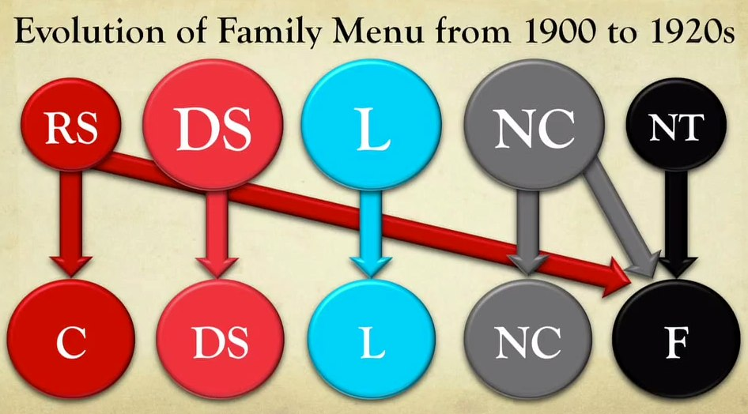

# New Orders Emerge (1917-1930)

## Total states
* states turn into gigantic factories of war:
  * they print lots of money
  * they control resources (e.g. agriculture, production of metals)
  * they control plants (either convert existing ones or create new ones)
  * they control manpower

## Political changes
* winners are going to be modernizers, industrializers, large land-owners; in other words, the national conservatives
* Russia: national traditionalists (with old-fashioned values), the monarchy, will be replaced
* Britain: coalition (in 1917) between the liberal party and the national conservatives
* Germany: turns into a military dictatorship (kaiser leaves room to the military)
* USA: liberalism (small state) retreats at the federal level

## Treaty of Brest-Litovsk 
* signed in 1918 by the Communists (the Bolsheviks), in order to end the war
* it concluded Russian participation in World War I, at substantial territorial cost to Russia

## Germany details
* General Ludendorff is a tactician, looking for a decisive battle
* 1917: unrestricted submarine warfare failed

## Factors for a turn of events in 1918
1. The Germans, from a tactically advantageous position, made some military mistakes
2. The Allies were able to leverage the entire world to their help (control of the sees, and trade routes with them, science (air power, intelligence))
3. Leadership and political resilience
  * France: Clemenceau 
  * Britain: Lloyd George
  * USA: Woodrow Wilson

## The end of 5 empires between 1910-1920
* Qing Empire is gone by 1912
* German Empire (ruled by Hohenzollern dynasty who ruled Prussia)
* Hapsburg dynasty (ruled Central Europe for centuries)
* Ottoman Empire (ruled South West Asia for centuries); last Sultan abdicated
* Russian Empire (ruled by the Romanov dynasty); last czar was murdered

## Measures in regard to defeated Germany in the aftermath of World War I
* New states were created out of former imperial territories, including part of the reconstituted Polish state
* The French put much of western Germany under military occupation in order to control German industrial capacity
* Strict limits were placed on the German military
* Germany gives up Lorraine

## Other consequences of the end of WWI
* Wilson (a Democrat) said that this was a "war to end war." He spoke of "peace without victory" and without revenge.
* Romania is enlarged
* Yugoslavia is formed
* British and French empires expand their domains in Africa
* USA decides not to ratify the Versailles treaty, and thus refutes to be part of the League of Nations
* imperial tutelage (by the League of Nations)
  * French look into Lebanon, Syria
  * British look into Iraq, Trans-Jordan, Palestine
* Egypt has nominal independence (with the British having military and political control over the Suez Canal)

## 'Washington system' for East Asia (1921-1922)
* 3 treaties signed in Washington
  * political relationships of the great powers
  * naval forces in ratio (USA:Britain:Japan => 5:5:3)
  * China integrity, signed by 9 powers (Japanese had to retreat from mainland China)
* orchestrated by Charles Evans Hughes
* Japanese had Korea as a colony since 1910 (and that didn't change after WWI)

## Anatolia
* Atatürk takes the lead after the collapse of the Ottoman Empire
* Atatürk is determined to unify his country, to create a ethnically-pure nation state
* confrontation with Greeks in the West, with the British in the North West
* Armenian genocide

## Russian Revolution
* before the revolution:
  * language of the Russian court through most of the 1800s has been French
  * that will change toward the end of 1800, for some russification process
  * Russian politics still very polarized
  * weak intermediate institutions (no power in parliament)
* early 1917: patriotic revolution
  * provisional government, led by the Democratic Socialists
* the Bolshevik coup: 
  * happens in November 1917
  * referred to as the "October Revolution" (Russians were using the Julian calendar, different from the Gregorian calendar, used by the rest of the world)
  * they overthrew the provisional govt

## The Bolsheviks
* they were called the "Reds" (versus the "Whites")
* not a mass movement, but led by a revolutionary vanguard
* their leader was Vladimir Lenin
* aided by Leon Trotsky, a Jewish
* Russian civil war ensued
* 1919: first Congress of the Communism International

## Anti-imperialism takes new form
* from "kick the foreigners out"
* to "take over the 'state' those foreigners have created"
* evolution of the political spectrum: 

## Indian National Congress
* an initiative to bring up all political and ethnic movements into one civic political structure

## Politics of the 1920s
* main political fault line is between communism and anti-communism
* Chinese Communist Party founded in Shanghai in 1921
* key military leaders of the Republic of China: Chang Kai-Shek
* Shanghai: center of a new national conservative Republic, sometimes with a fascist totalitarianism taste

## Major reasons why WWI was so important to the rise of communism
* the failure of liberal institutions to prevent or stop the war strengthened the attraction of communism as an alternative
* the chaos and dislocation created by World War I made for conditions that were ripe for exploitation by disciplined communist cells that were prepared to fill the void left by the shattered empires

## A period of massive human loss
* WWI's toll: 9 to 10 million killed
* most people killed were soldiers (contrasting with WWII)
* influenza epidemic: 1918-1919, 10 to 20 millions

## Loss in the spiritual dimension
* sharp decrease in the missionary zeal
* rise of the subconscious, psycho-analysis (Sigmund Freud, Carl Jung)

## Fascism
* against individualism, and toward the state
* opposed to classical Liberalism which arose from the necessity of reacting against absolutism
* the state recreates the nation (as opposed to the nation which creates the state)

# The impact of radio
* late 1800s: telegraph supplanted by the wireless devise (Marconi set)
* broadcast radio arises after WWI
* transforms a world which was very local

## Rise of 'Global America'
* consumerism
* cars
* radio
* movies

## Women's right
* strong movement in the 1910s and 1920s
* facilitating factors:
  * liberalism having the upper hand in the 1860s
  * anti-slavery movement
* protecting themselves (to get bans on the sale of alcohol)
* transmission belts for the 'modern girl': Tokyo, Shanghai, Saigon, Djakarta
* Events such as the Triangle Shirtwaist fire in 1911 in New York encouraged women to seek the vote so they could support workplace safety measures to protect other women

## Treaty of Locarno
* Locarno: city in the south of Switzerland
* signed in 1925 after WWI
* this enabled Germany to be admitted to the League of Nations
* the "Spirit of Locarno": the spirit of international cooperation, political normalization, territorial stabilization, and cautious optimism that arose among the West European nations during the 1920s
