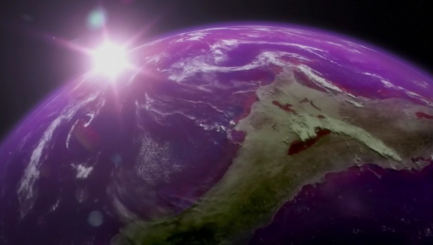
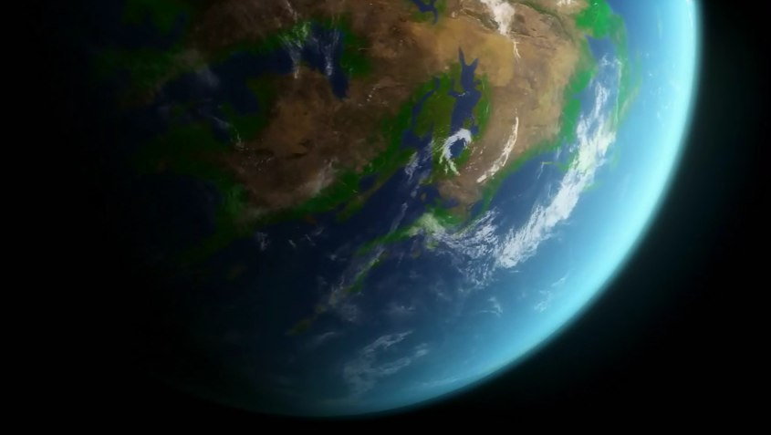
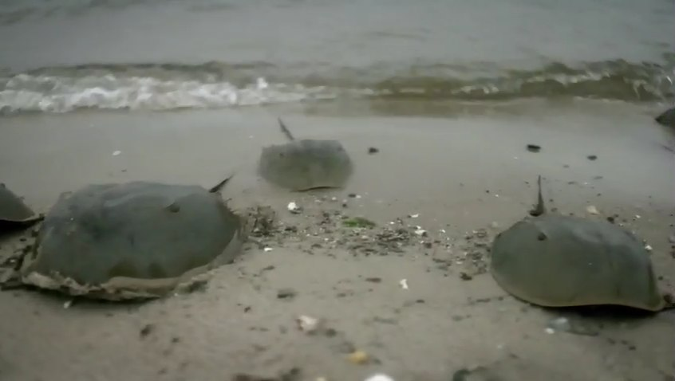
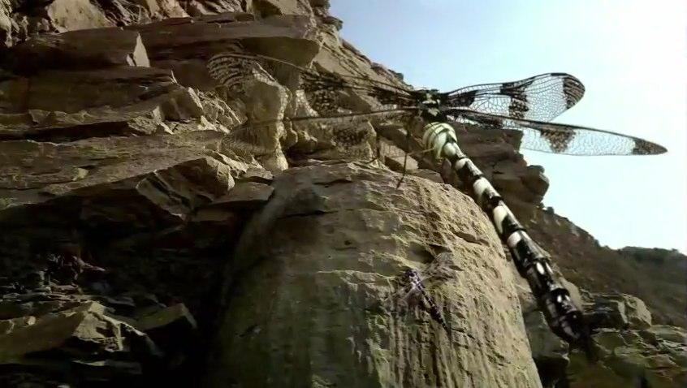

# Découverte sur les plantes (1/3)

## Intro
* les plantes ont produit le premier oxygène
* les plantes fabriquent la vie à partir de la lumière
* photosynthèse: processus naturel le plus important sur la Terre

## Il y a 3 milliards d'année dans le passé:
* très peu d'oxygène
* atmosphère: cocktail de gaz toxiques
* sol sans vie
* l'atmosphère ne pouvait pas filtrer les UV du soleil

## Création de la première atmosphère terrestre
* point tournant de la vie sur Terre
* tout a commencé sous l'eau
* eau = écran solaire liquide filtrant les UV dangereux
* les premiers organismes ont formé de minuscule bactéries (violettes)
* la Terre devait ressembler à ça: 
* les cyano-bactéries (vertes)
  * plus en profondeur dans l'eau
  * sont les ancêtres de toutes les plantes sur Terre
  * elles produisent de l'oxygène (qui formera éventuellement l'atmosphère)

## La création d'oxygène
* les chloroplastes 
  * se trouvent dans chacune des cellules des plantes
  * endroit où se passe la photosynthèse 
  * elles produisent l'oxygène à partir de l'eau (2 H et 1 O)
* les plantes utilisent l'hydrogène pour vivre et croître
* elles rejettent l'oxygène
* grâce aux plantes, il y a eu un passage irréversible d'une planète presque vide d'oxygène libre à une planète qui regorge d'oxygène
* photosynthèse: lorsqu'un végétal reçoit de la lumière, il absorbe le CO2 présent dans l'air et rejette de l'O2
* mais lorsque le végétal est dans l'obscurité, la plante absorbe de l'O2 et rejette du CO2

## La couche d'ozone
* la production d'oxygène a produit de l'ozone (O3)
* couche protectrice qui bloque les UV nocifs du soleil
* ainsi, les plantes ont pu migrer sur le sol

## Les racines
* les plantes ont commencé à sortir de l'eau: 
* les premières racines sont apparues il y a environ 400 millions d'années
* les racines ont permis de briser le rock
* elles vont éventuellement transformer la terre en terre meuble
* terres meubles aujourd'hui: 40% de la surface émergée

## les limules 
* ils sont parmi les tout premiers animaux sortis de l'eau
* Voilà à quoi ressemble un limule: 
* l'oxygène (qui se trouvait à l'extérieur de l'eau) leur a permis de sortir de l'eau

## Les sucres produits par les plantes
* la photosynthèse produit des sucres, source de nourriture pour tous les animaux
* les plantes produisent ce sucre à partir de:
  * O
  * CO2
  * énergie du soleil
* la plante, aidé par le soleil, combine le H au CO2 pour produire du sucre

## Risque d'asphyxie des plantes (par manque de CO2)
* les plantes avaient besoin de plus de CO2
* elles ont développé des feuilles pour capter plus de CO2
* 1 fougère peut aspirer 5L de CO2 par jour
* le niveau d'O a beaucoup augmenté (le double d'aujourd'hui)
* la taille des invertébrés est dépendant du taux d'O dans l'air
* les invertébrés étaient donc probablement beaucoup plus gros à cette époque: 

## Les dinosaures
* il y a 230 millions d'années, un nouveau groupe d'animaux: les dinosaures
* les végétariens dominaient
* pendant 200 millions d'années, les dinosaures ont côtoyé les plantes
* les conifères élevaient leurs branches hors de portée, pour se protéger des dinosaures
* 65 millions d'années: astéroïde éradiquent les dinosaures
* plantes à fleurs sont apparues après l'extinction des dinosaures
