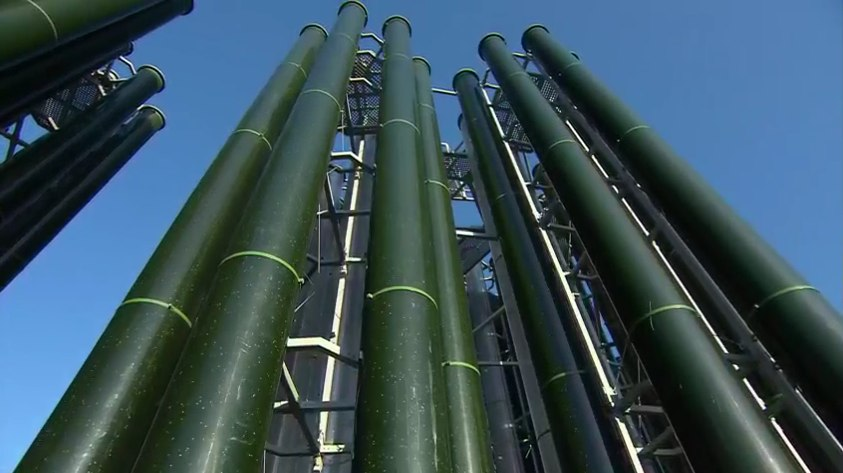

# Les micro-algues

## Méta
* Découverte, émission du 14 avril 2013

## Contexte
* bio-carburant à base d'algues microcospiques
* les cimenteries 
  * sont de grands producteurs de CO2
  * elles produisent 10% du CO2 produit par les industries lourdes
  * ce CO2 (après purification) sert d'intrant pour la production des micro-algues
* il existe plus de 400 compagnies dans le monde qui travaillent sur les micro-algues (dont plusieurs sont financées par de grandes pétrolières)
* Bio Fuel Systems en est une

## Inspiration de la nature
* phytoplancton: 50% de la biomasse produite sur la planète
* il se nourrit de CO2
* ce sont les microorganismes (micro-algues) contenus dans le phytoplancton qui produisent le pétrole
* pétrole = micro-algue + soleil + CO2 + eau

## Un remplacement pour le pétrole
* les micro-algues produisent une biomasse riche en lipides (en particulier des acides gras)
* ces acides gras sont constitués d'une chaîne de carbone qui a une grande similarité avec celle contenue dans les hydrocarbures fossiles 

## Procédé de fabrication des micro-algues
* aidé par le soleil et le CO2, on laisse reproduire les micro-algues dans des tubes au soleil
* lorsque la concentration est assez élevée, on se débarrasse de l'eau à l'aide d'une centrifugeuse
* on obtient une pâte verte visqueuse, avec une très haute concentration en acides gras (bourrés en carbone)
* voilà les tubes dans lesquels les micro-algues se reproduisent: 

## Comparaison de la valeur énergétique
* la valeur énergétique se definit en kCal / kg
* pouvoir calorifique = la valeur énergétique lors de sa combustion
* comparaison avec le pétrole
  * 1 baril d'essence produit 10 500 kCal/kg
  * 1 baril de pétrole vert produit 9700 kCal/kg

## Avantages du pétrole vert
* on peut récupérer le CO2 émit par les industries pour constituer les micro-algues
* 50% moins de CO2 produit lors de la combustion qu'il en a fallu pour le constituer
  * il faut 2 tonnes de CO2 pour faire 1 baril de pétrole vert
  * la combustion d'1 baril de pétrole vert ne produit qu'une seule tonne de CO2
  * par contre on ne mentionne pas le ratio CO2 pour le pétrole conventionnel :(
* le pétrole vert peut être consumé par les moteurs actuels, sans rien changer
