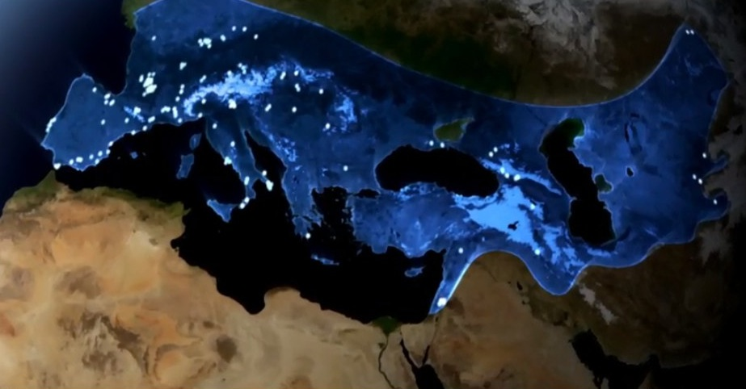
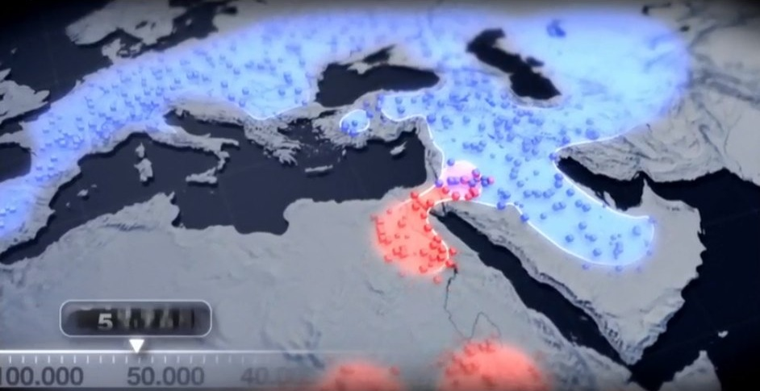

# L'homme de Néandertal

## Méta
* titre: Le Néandertal en nous
* source: http://www.tou.tv/le-neandertal-en-nous

## intro
* l'homme moderne est descendant de l'Homo sapiens (et non du Néandertal)
* l'étude des génomes du néandertalien et de l'homme moderne montre qu'ils se sont mélangés par le passé
* certains d'entre nous portent donc, dans leurs gènes, un peu de Néandertal
* le nom de "Néandertal" vient de l'endroit où l'on a découvert les premiers ossements de Néandertal en Allemagne

## La chronologie de l'homme de Néandertal
* il a 500 000 ans, les anciennes lignées d'homonidées se séparent entre les ancêtres de l'homme anatomiquement moderne et les pré-néandertaliens
* ces pré-néandertaliens quittent le continent africain par l'Égypte et se répartissent au Moyen-Orient et dans toute l'Europe
* voici les endroits où on a trouvé des ossements néandertaliens:
* 
* l'homme de néandertal a vécu pendant quelque 200 000 ans
* l'homo sapiens (à ce moment en Afrique) et le Néandertal (en Eurasie) ont donc vécu géographiquemnet séparement pendant très longtemps
* il y a 100 000 - 50 000 ans, l'homme anatomiquement moderne quitte à son tour l'Afrique
* c'est lorsque l'homo sapiens est sorti de l'Afrique par l'Égypte qu'il y a eu un mélange avec l'ADN néandertalien:
* 

## La propagation des gènes du néandertal 
* après être sorti d'Afrique, l'homme moderne part à la conquête du monde, emportant donc avec lui un peu d'ADN néandertalien
* ceci explique pourquoi on retrouve certains gènes du néandertal dans des endroits géographiques où l'homme néandertal n'a jamais mis les pieds
* l'homme de Néandertal a disparu il y a environ 30 000 ans
* l'homme moderne a re-conquis le nord de l'Afrique (par le détroit de Gibraltar) et s'est arrêté au milieu
* voilà pourquoi la moitié sud de l'Afrique n'a pas de gènes de néandertal
